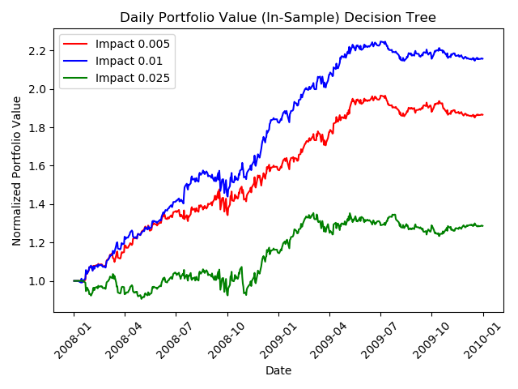

# tradingStrategies
[testproject.py](testproject.py) is the main driver file. Here you can adjust the parameters for the analysis. The variables are the stock symbol, start date, end date (for training and test) and the starting value (in dollars) for the portfolio.

# Plots

