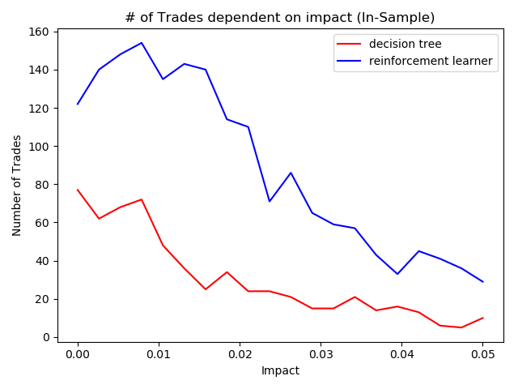

# tradingStrategies
Development was done in a conda environment and the [environment.yml](environment.yml) file defines all the dependencies.

[testproject.py](testproject.py) is the main driver file. Here you can adjust the parameters for the analysis. The variables are the stock symbol, start date, end date (for training and test) and the starting value (in dollars) for the portfolio. For the analysis here, the values used were:

```
symbol="JPM"  
sd=dt.datetime(2008, 1, 1)  
sdTest=dt.datetime(2010, 1, 1)  
ed=dt.datetime(2009, 12, 31)  
edTest=dt.datetime(2011, 12, 31)  
sv=100000
```

The five charts as well as a .txt file with statistics are written to the [outputs](/outputs) directory.

The [data](/data) directory contains csv files with historic data for respective stock symbols.

# Alternate Parameters
[decision_tree_strategy.py](decision_tree_strategy.py) has three parameters that will have varying effects on performance: leaf_size, bags, & boost. I defined them them as follows:

```
kwargs = {"leaf_size": 10}  
bags = 30  
boost = False
```

[reinforcement_learning_strategy.py](reinforcement_learning_strategy.py) has 6 parameters that can be changed for varying performance: self.lookback, alpha, gamma, rar, radr, and dyna. I defined them as follows:

```
self.lookback = 20  
alpha = 0.2  
gamma = 0.9  
rar = 0.98    
radr = 0.999  
dyna = 0
```

# Visualizations
 




# File Breakdowns

[util.py](util.py)  
This file contains some utility functions that the other files can use for processing of data. The "get_data" function is called multiple times from multiple separate files. This function builds and returns a data frame with daily stock data from the csv files in the data folder.

[marketsimcode.py](marketsimcode.py)  
This file takes in a dataframe that specifies buy or sell orders for each day and a respective stock symobl. It creates and returns a dataframe representing daily portfolio values based off the trades.

[indicators.py](indicators.py)  
This file contains the logic for calculating the three technical indicators data that the strategies use to make their trading decisions. The three indicators are the bollinger band percentage (BBP), relative strength index (RSI), and an exponential moving average cross (EMA Cross) which combines ema with a a 13 and 21 day lookback period into one indicator.

[ManualStrategy.py](ManualStrategy.py)  
This file's parameters were tuned with trial and error on the training data. Entering a long or short position is based on hardcoded thresholds for the three technical indicators.

[RTLearner.py](RTLearner.py)  
This file is the logic behind the decision tree strategy. It builds and queries the decision tree. Both functions utilize recursive logic. It randomly selects a feature to split on (those being the bbp value, rsi value, or ema_cross value).

[BagLearner.py](BagLearner.py)  
This file combines multiple instances of the RTLearner class and returns a more robust model.

[decision_tree_strategy.py](decision_tree_strategy.py)  
This file utilizes the BagLearner class which encompasses the RTLearner class. This is a supervised learning method where the "X" values are the daily technical indicator values. The "Y" value is created by dividing the closing price five days from present by the closing price for the present day. The intuition here is that if the value five days from present is greater than today, then buying today would yield more return than just holding cash. Then after looking into what these values could be, I arrived at setting a threshold of 0.03 +- impact to decide either to flag a long (+1) signal or a short (-1) signal. So, then we have three features (X) for today (techincal indicator values) and a single integer (+1 or -1) representing our "Y" value.
Then the x and y data is fed to the BagLearner and furthermore RTLearner to "add_evidence" and build the tree and then the "query" function is used to make buy or sell decisions on new or existing data.

[QLearner.py](QLearner.py)

[reinforcement_learning_strategy.py](reinforcement_learning_strategy.py)

[testproject.py](testproject.py)  
This is the main dirver file that brings everything together. It runs a few analysis functions that plot the data and write statistics to a .txt file. The functions "analysis_1" and "analysis_2" are the main functions while the others are helper functions for these two main ones.
